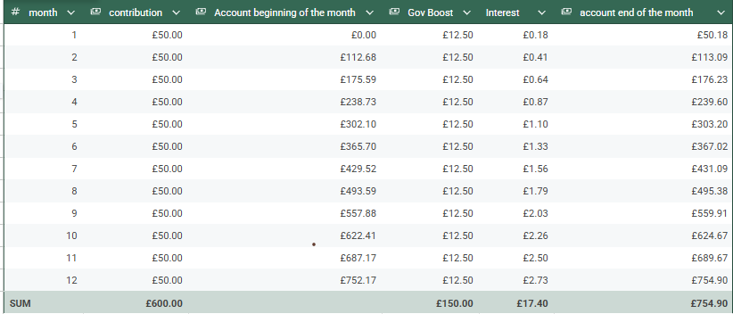

Lifetime ISA

Software Development Life Cycle (SDLC)
1. Planning - establish project goals, scopes, risks and MVP
2. Requirement Analysis - Gather detailed functional and non-functional requirements collaboratively
3. Design - Create a system architecture, workflows and UI/UX plans
4. Developent (Coding) - Start building the software using chosen tech stack
5. Testing - Run multiple tests to ensure quality and performance
6. Deployment - Replase software with miminal downtime using best practices
7.  Monitoring - Monitor, fix issues , and improve based on feedback

Main Functions
# once users enter their values, this func will store them into variables in the main func
def user_input 

# all calculations needed will be called here and then return the result
def calculation

# what calculations?
# Annual Equivalent Rate (AER) - basically the compounding interest based on contribution
# 25% Goverment Boost interest - month/annual accumulated boost based on contribution

# all logic flow will be here
def main

# Expected outcome
£50 contribution
for 1 year
boost for one year is 0.045 + 0.25

This image shows my own calcualtions for a 1 year plan of an account that contributes £50/month
This table was checked against Nottingham Building Society and it comes to accurate 0.01% difference which is good.
From this my requirement analysis have been changed, giving me a much more clear planning strategy.
